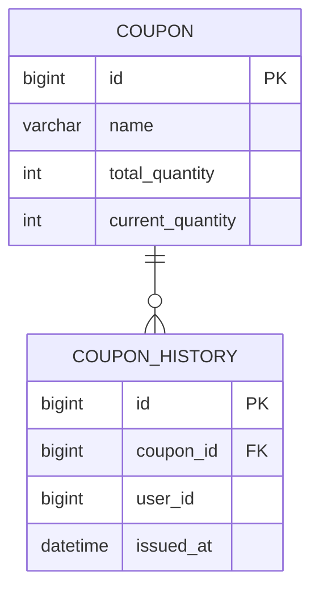
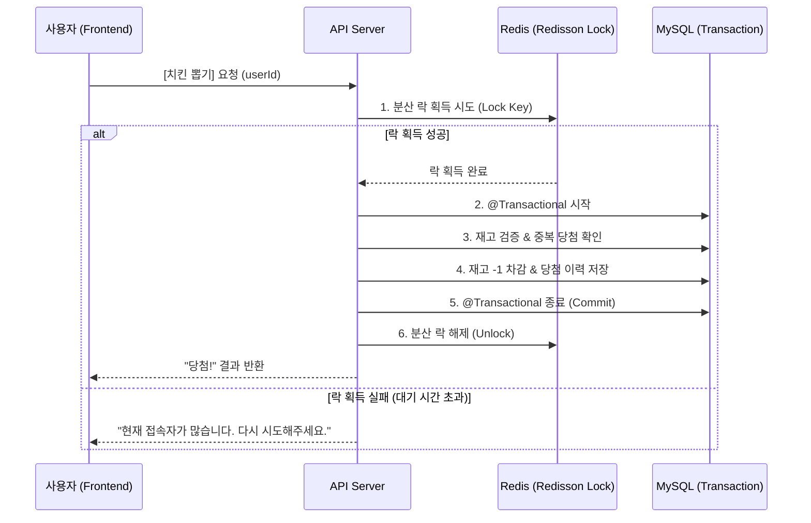

# 🍗 ChickenGet (치킨 가챠 시스템)

## 📝 프로젝트 개요
`ChickenGet`은 실시간 선착순 치킨 쿠폰 이벤트를 시뮬레이션하는 웹 애플리케이션입니다.

수천 명의 사용자가 동시에 접속하여 제한된 수량의 쿠폰을 뽑는 상황에서 **데이터의 정합성을 보장**하고 **동시성 제어**를 수행하는 데 중점을 두었습니다. `Redis` 기반의 분산 락(`Redisson`)을 활용하여 초과 당첨(Race Condition)을 방지하고 정확한 재고 차감 로직을 구현하였습니다.

## 📊 데이터베이스 구조 (ERD)



## 🛠 구현 내용

### Backend (Spring Boot)
- **가챠 API**: `POST /api/v1/gacha/draw?userId={id}` 엔드포인트 구현
- **동시성 제어**: `Redisson`을 이용한 분산 락(Distributed Lock) 적용으로 중복 당첨 및 재고 오류 방지
- **데이터베이스**: MySQL(영속성) 및 Redis(분산 락 관리) 연동

### Frontend (Next.js)
- **가챠 페이지**: `/gacha` 경로에서 치킨 쿠폰 뽑기 UI 및 상태 관리(IDLE, LOADING, SUCCESS, ERROR) 구현
- **스타일링**: Tailwind CSS를 활용한 반응형 디자인
- **API 연동**: `fetch` API를 사용한 백엔드 서버 통신

---

## 🚀 실행 방법

### 1. 인프라 실행 (Docker)
루트 디렉토리에서 MySQL과 Redis를 실행합니다.
```bash
docker-compose up -d
```

### 2. 백엔드 서버 실행
`backend` 디렉토리에서 실행합니다.
```bash
cd backend
./gradlew bootRun
```
- API 주소: `http://localhost:8080`
- **Swagger UI (API 문서)**: `http://localhost:8080/swagger-ui/index.html`

### 3. 프론트엔드 서버 실행
`frontend` 디렉토리에서 실행합니다.
```bash
cd frontend
npm install
npm run dev
```
- 접속 주소: `http://localhost:3000` (자동으로 `/gacha`로 이동)

---

## 🔄 가챠 발급 내부 로직 (Workflow)

사용자가 [치킨 뽑기] 버튼을 클릭했을 때, 시스템 내부에서 정합성을 보장하기 위해 수행되는 단계입니다.



### 🛠 단계별 상세 설명
1.  **요청 수신**: API 서버가 유저 ID와 요청을 받습니다.
2.  **분산 락 획득 (Redisson)**: Redis를 통해 특정 쿠폰 자원에 대한 자물쇠를 겁니다. (Race Condition 방지)
3.  **트랜잭션 시작 (@Transactional)**: DB 작업을 하나의 원자적 단위로 묶습니다.
4.  **재고 검증**: DB에서 남은 수량을 조회하고 0개면 즉시 실패를 반환합니다.
5.  **재고 차감 및 저장**: 수량을 1 줄이고 유저의 당첨 이력(`CouponHistory`)을 저장합니다.
6.  **트랜잭션 종료 (Commit)**: DB에 모든 변경 사항을 확정합니다.
7.  **분산 락 해제 (Unlock)**: 자물쇠를 풀어 다음 대기자가 처리될 수 있도록 합니다.
8.  **결과 반환**: 사용자에게 최종 성공/실패 메시지를 전달합니다.

---

## 🧠 핵심 설계 의사결정 (Design Decisions)

채용 담당자 및 리뷰어를 위해 본 프로젝트의 주요 설계 의도와 기술적 선택 배경을 정리하였습니다.

### 1. 연관 관계 매핑(@ManyToOne) 대신 ID 참조 방식 선택
- **의도**: 도메인 간의 결합도(Coupling)를 낮추어 시스템 확장성을 확보하기 위함입니다.
- **선택 배경**: 객체 참조 방식은 개발이 편리하지만, 향후 서비스 규모가 커져 '쿠폰'과 '이력' 도메인이 마이크로서비스(MSA)로 분리될 경우를 대비하였습니다. 또한, 고부하 상황에서 불필요한 엔티티 로딩 오버헤드를 줄여 성능을 최적화했습니다.

### 2. DB Unique 제약 조건을 통한 데이터 정합성 보장
- **의도**: 애플리케이션 계층의 로직에만 의존하지 않고, 데이터베이스 계층에서 최종적인 데이터 무결성을 보장하기 위함입니다.
- **선택 배경**: 분산 환경에서 다수의 요청이 동시에 들어올 경우(Race Condition), 자바 코드 수준의 중복 체크만으로는 데이터 정합성이 깨질 위험이 있습니다. `CouponHistory` 테이블에 `(userId, couponId)` 복합 유니크 제약 조건을 설정하여, 어떤 상황에서도 동일 유저에게 쿠폰이 중복 발급되는 것을 물리적으로 차단했습니다.

### 3. 발급 이력(CouponHistory)의 분리 운영
- **의도**: 단순 재고 수량 관리(`Coupon`)와 비즈니스 행위 기록(`History`)의 역할을 명확히 분리하였습니다.
- **활용**: 중복 참여 방지 로직의 근거 데이터로 활용할 뿐만 아니라, 향후 당첨 증빙, CS 대응, 마케팅 분석을 위한 감사 로그(Audit Log) 역할을 수행할 수 있도록 설계했습니다.

