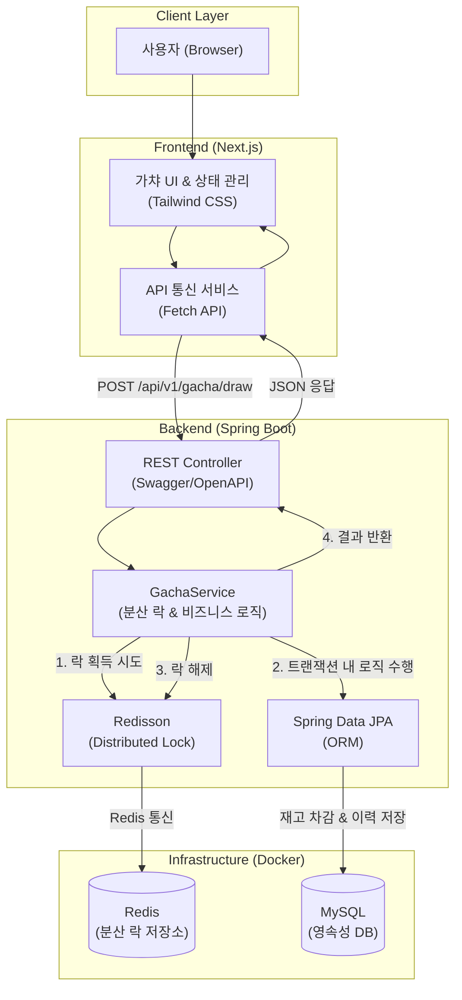
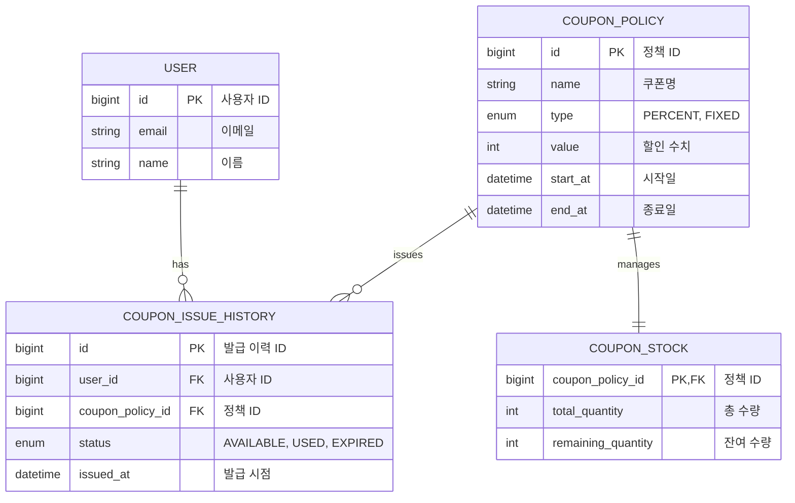

# 🍗 선착순 치킨 할인 쿠폰 시스템


교촌치킨을 모티브로 만든 치킨 할인쿠폰 이벤트 API 서버 토이 프로젝트입니다.


### 🍗 월 200만명 이상 사용하고 있는 서비스에서 쿠폰 이벤트를 한다면?
순간적으로 몰리는 쿠폰 발급 요청이 어떻게 안정적으로 처리되고 있는 것일까?   
동시성 이슈로 인한 쿠폰 중복 발급을 어떻게 방지하고 있을까?    
이러한 궁금증들을 통해서 직접 교촌치킨 서버를 구현해보는 프로젝트를 진행하게 되었습니다.


### 🍗 AI를 활용했지만 무작정 수용하지 않았습니다.
보조 도구로 사용하면서도 스스로 코드를 검증할 수 있도록  
왜 이 기술을 써야 하는지, 언제 이 방식이 문제가 되는지,   
동작 원리는 무엇인지를 그냥 넘기지 않고 고민했습니다.


### 🍗 핵심 설계 의사결정 과정 
- [6000명이 동시에 쿠폰 발급을 요청한다면?](https://j-do-challenge.tistory.com/97)

## 🍗 시스템 아키텍쳐 



## 🍗 데이터베이스 구조 (ERD)


---

## 실행 방법

### 1. 인프라 실행 (Docker)
루트 디렉토리에서 MySQL과 Redis를 실행합니다.
```bash
docker-compose up -d
```

### 2. 백엔드 서버 실행
`backend` 디렉토리에서 실행합니다.
```bash
cd backend
./gradlew bootRun
```
- API 주소: `http://localhost:8080`
- **Swagger UI (API 문서)**: `http://localhost:8080/swagger-ui/index.html`

### 3. 프론트엔드 서버 실행
`frontend` 디렉토리에서 실행합니다.
```bash
cd frontend
npm install
npm run dev
```
- 접속 주소: `http://localhost:3000`